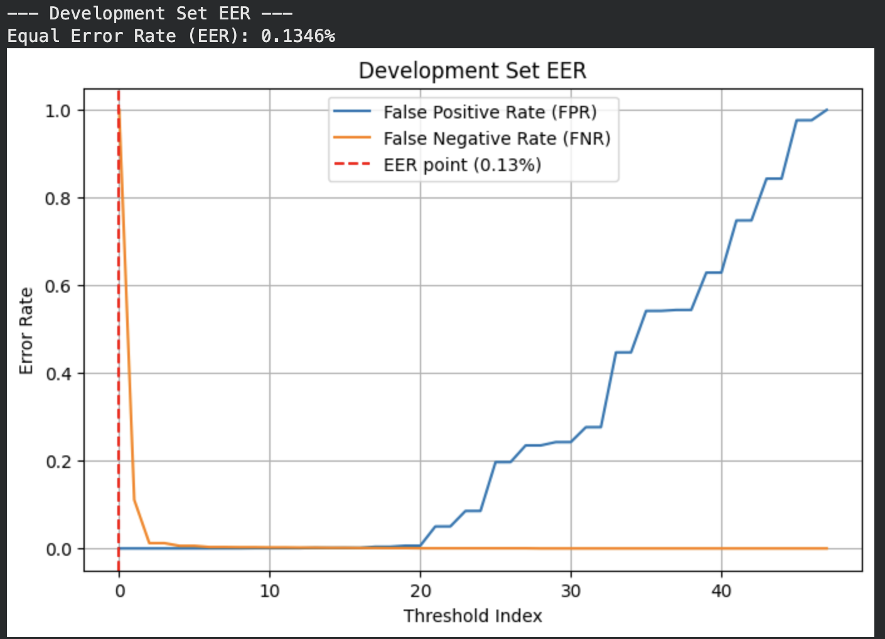
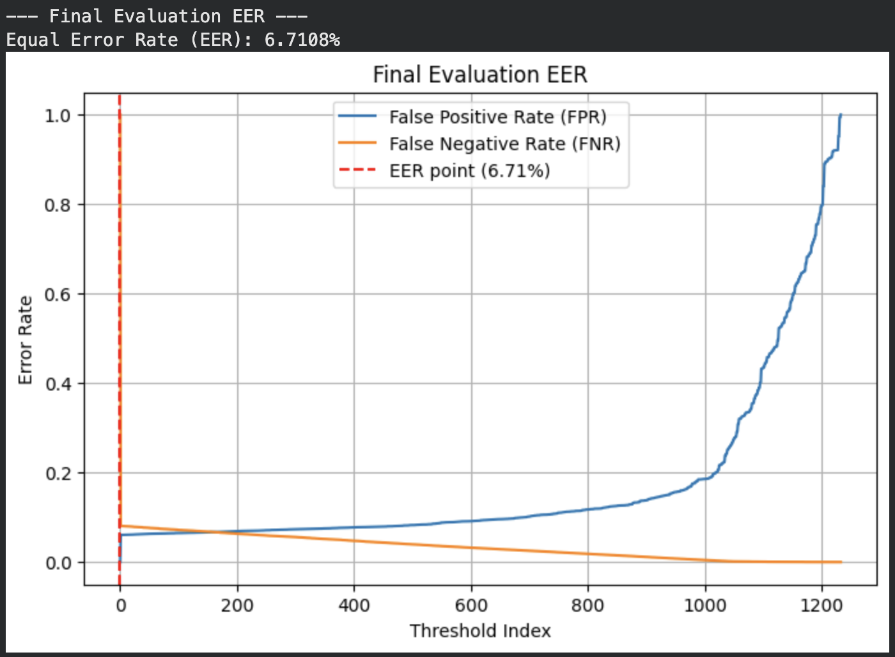

# ASVspoof 2019

This repository contains a PyTorch-based Countermeasure (CM) system designed to protect Automatic Speaker Verification (ASV) systems from voice spoofing attacks.
So far for this project I've completed the **CNN** model implementation for the Logical Access dataset from the ASVspoof 2019 challenge. (04/09/2026)
The CNN model was trained using the L4 GPU on Google Colab.

## Performance Overview
| Metric | Official LFCC-GMM Baseline | **My LFCC CNN Implementation** |
| :--- | :--- | :--- |
| **Eval EER** | 8.09% | **6.71%** |
| **min t-DCF** | 0.2116 | **0.1601** |

*these are the baseline scores provided from https://arxiv.org/pdf/1911.01601*
*this only covers the LA dataset, i am working towards implementing a CM for the PA dataset*

There is large discrepancy when comparing my model's performance against the Development and Evaluation dataset. The reason for that is because the Development dataset showcases spoof's that were created in the same way the Training dataset was. The Evaluation dataset has spoof's that were created with more advanced and unseen techniques, to ensure that the model could capture defects in the real-world, rather than simply "remembering" the spoofs.

---

## Technical Architecture - Logical Access

### Feature Engineering and Extraction
I created **Linear Frequency Cepstral Coefficients (LFCC)** to capture the digital artifacts and mathematical error that may have been left over from the models that created the spoofed voices.
* **Input Shape:** $20 \times 400$ (20 coefficients across 400 temporal frames).
* **Pre-processing:** Applied pre-emphasis ($0.97$) and standardized duration via zero-padding and truncation.

### Model: 2D Convolutional Neural Network
The core model is a 2D CNN optimized for spectrogram-like feature maps.
* **Frontend:** 2x Convolutional layers with Batch Normalization.
* **Max Pooling:** Strategically placed down-sampling layers to capture the most important "spoof" signatures. This also improves efficiency.
* **Backend:** Fully connected layers mapped to a Softmax output for binary classification - 1 for bonafide, 0 for spoof

---

## Evaluation & Metrics
There are two metrics given by the ASVspoof 2019 evaluation plan, namely the **Tandem Detection Cost Function (t-DCF)** and the **Equal Error Rate (EER)**.
The t-DCF was introduced for the 2019 challenge, and is the primary metric as it takes into account the ASV system as well, taking in the system as a whole. The EER only measures the countermeasure.
* **Tandem Detection Cost Function (t-DCF):** The primary metric of the ASVspoof challenge. My score of **0.1601** indicates a security gain (over the baseline t-DCF of 0.2116 - *the closer to zero the better*), proving the model is effective at catching "dangerous" spoofs that bypass standard ASV systems.
* **Equal Error Rate (EER):** The balanced threshold where the False Positive Rate (FPR) equals the False Negative Rate (FNR). My model found an improvement of the baseline in terms of EER, **6.71%** over the baseline 8.09%.

---

## Planning...
* **Implementing an Physical Access model:** Instead of the LFCC used for the Logical Access scenario, I believe **Constant Q Cepstral Coefficient** (CQCC) are the standard for PA, due to the extra factors of PA, like room sizes, speaker/microphone quality.

---

## Author
**Andrew Ngo** *Computer Engineering Student, Wichita State University*